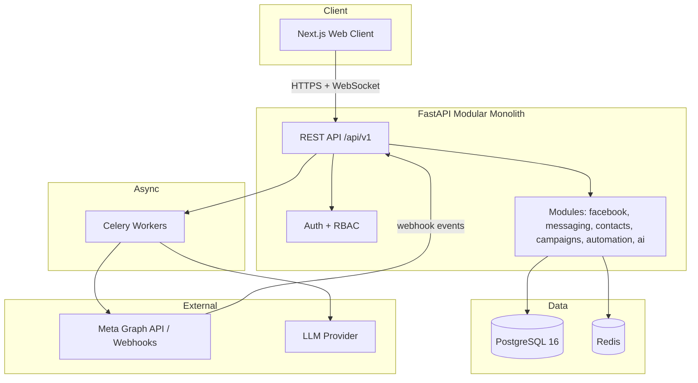

<p align="center">
  
</p>

<p align="center">
  <a href="#-features"></a>
  <a href="#-tech-stack"></a>
  <a href="#-tech-stack"></a>
  <a href="#-tech-stack"></a>
  <a href="#-tech-stack"></a>
  <a href="LICENSE"></a>
</p>

<p align="center">
  <em>One workspace for every Facebook conversation, lead, and automation — controlled in plain English.</em>
</p>

---

## 🌟 Overview

**PagePilot** is a multi-tenant SaaS platform that lets businesses connect multiple **Facebook Pages** and manage all their Messenger communication from a single, unified dashboard — eliminating repetitive manual messaging.

| | The Problem | The PagePilot Solution |
|---|---|---|
| 💬 | Switching between many Facebook inboxes | **One unified inbox** for every connected Page |
| ⏱️ | Missed &amp; slow customer replies | Real-time inbox + AI drafting + automation |
| 🔁 | Repetitive questions answered manually | Knowledge base + templates + AI replies |
| 🎯 | Leads buried in chat history | Structured CRM with scoring, tags &amp; segmentation |
| 📣 | Campaigns sent one-by-one | Compliant queued campaigns with delivery tracking |
| 🔌 | Disconnected tooling | One workspace: Pages, inbox, CRM, campaigns, automation, analytics |
| 🤖 | No natural-language control | **AI assistant** that understands &amp; safely executes business workflows |

---

## ✨ Features

- 💬 **Unified Inbox** — every conversation across all Pages, with real-time updates, assignment, labels, and search
- 👥 **Contacts & Leads CRM** — auto-captured leads with scoring, status pipeline, product-interest tagging, and segmentation
- ⚡ **Automation Engine** — visual `Trigger → Conditions → Actions` workflows with delays, branching, and test mode
- 📣 **Compliant Campaigns** — audience messaging that respects Meta's 24-hour window and message tags
- 🤖 **AI Assistant** — a *natural-language* business automation assistant (read, search, summarize, draft — and, only with confirmation, send/start) that never bypasses Meta policies
- 📊 **Analytics** — response times, lead conversion, campaign delivery, and AI action tracking

---

## 🏗️ System Architecture



---

## 💡 Core Value Proposition

Three things no single competing tool combines today:

1. **True multi-Page, multi-tenant workspace** with a real CRM — not just a chat viewer.
2. **Policy-aware automation &amp; campaigns** that are *useful* but *non-banning* — they respect Meta's 24-hour window, messaging types, and message tags, and tell you honestly when something can't be sent.
3. **A safe natural-language AI assistant** that does real work behind an explicit `READ / PREPARE / WRITE / EXTERNAL` permission model — never an unrestricted agent.

---

## 🛠️ Tech Stack

| Layer | Technology | Why |
|---|---|---|
| **Frontend** | Next.js 15 · React 19 · TypeScript · Tailwind CSS · TanStack Query | Type-safe, fast, modern web UI |
| **Backend** | Python 3.12 · FastAPI · SQLAlchemy 2.0 (async) · Pydantic v2 | Async I/O for high webhook throughput + first-class OpenAPI |
| **Database** | PostgreSQL 16 (SQLite for local demo) | Relational integrity, JSONB, full-text search, multi-tenancy |
| **Cache / Queue** | Redis · Celery | Background jobs, rate-limited sends, real-time pub/sub |
| **Real-time** | WebSockets + Redis Pub/Sub | Instant inbox updates without refresh |
| **AI** | LLM with structured outputs + tool calling (provider-configurable) | Safe, controllable AI assistant |

---

## 📦 Project Structure

```
Page-pilot-AI-/
├── docs/                       # Complete product & system architecture (37 files)
├── backend/                    # FastAPI modular monolith (Python 3.12)
│   ├── alembic/                # Database migrations
│   └── src/app/
│       ├── core/               # config, security, db, errors
│       ├── models/             # SQLAlchemy ORM (33 tables)
│       ├── schemas/            # Pydantic schemas
│       ├── modules/            # auth, facebook, (more)
│       ├── services/           # Meta client, encryption
│       └── workers/            # Celery tasks
├── frontend/                   # Next.js 15 + React 19 + TypeScript + Tailwind
├── docker-compose.yml          # Optional Postgres + Redis
└── README.md
```

---

## 🚀 Getting Started

### Prerequisites
- Python 3.12+
- Node.js 20+
- PostgreSQL 16 (or Supabase / SQLite for local)
- Redis (for background jobs)

### 1. Backend

```powershell
cd "Page-pilot-AI-"
.venv\Scripts\python.exe -m venv .venv           # first time
.venv\Scripts\pip install -e "backend[dev]"
copy backend\.env.example backend\.env            # then fill in real values
$env:PYTHONPATH = "backend/src"
.venv\Scripts\python.exe -m uvicorn app.main:app --host 127.0.0.1 --port 8000 --reload
```

Open **http://127.0.0.1:8000/docs** for the interactive API.

### 2. Frontend

```powershell
cd "Page-pilot-AI-/frontend"
npm install
npm run dev
```

Open **http://127.0.0.1:3000**.

---

## ⚙️ Configuration

Copy `backend/.env.example` → `backend/.env` and set:

| Variable | Purpose |
|---|---|
| `DATABASE_URL` | Postgres/Supabase URL (or `sqlite+aiosqlite:///./pagepilot.db` for local) |
| `META_APP_ID` / `META_APP_SECRET` | Facebook Developer App credentials |
| `META_GRAPH_VERSION` | Graph API version (default `v26.0`) |
| `REDIS_URL` | Redis connection |
| `LLM_API_KEY` | AI provider key (Phase 13+) |
| `SECRET_KEY` | JWT signing secret |

> 🔒 **Never commit `.env` or any secrets.** The `.env` file is gitignored.

---

## 🧪 Testing

```powershell
$env:PYTHONPATH = "backend/src"
.venv\Scripts\python.exe -m pytest backend/tests -q
```

---

## 🗺️ Development Status

| Phase | Milestone | Status |
|---|---|---|
| 0 | Product documentation &amp; architecture | ✅ Done |
| 1 | Repository &amp; dev environment | ✅ Done |
| 2 | Authentication &amp; workspace | ✅ Done |
| 3 | Database foundation (33 tables) | ✅ Done |
| 4 | Meta OAuth | ✅ Done |
| 5 | Facebook Page connection | ✅ Done |
| 6 | Webhook infrastructure | 🔜 In progress |
| 7 | Messenger send/receive | ⬜ Planned |
| 8 | Unified inbox | ⬜ Planned |
| 9 | Contacts &amp; leads CRM | ⬜ Planned |
| 10–19 | Campaigns, automation, AI, analytics, RBAC, security, deploy | ⬜ Planned |

---

## 📚 Documentation

Full product specification and system architecture in [`/docs`](./docs). Start with [`docs/00-overview.md`](./docs/00-overview.md).

## 🤝 Contributing

This is a proprietary project. Contact the repository owner for collaboration.

## 📄 License

Proprietary. All rights reserved.
