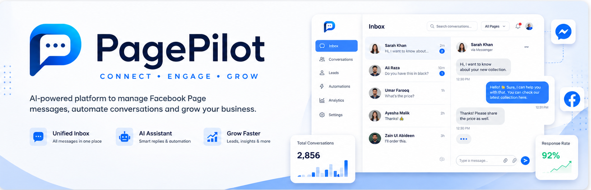
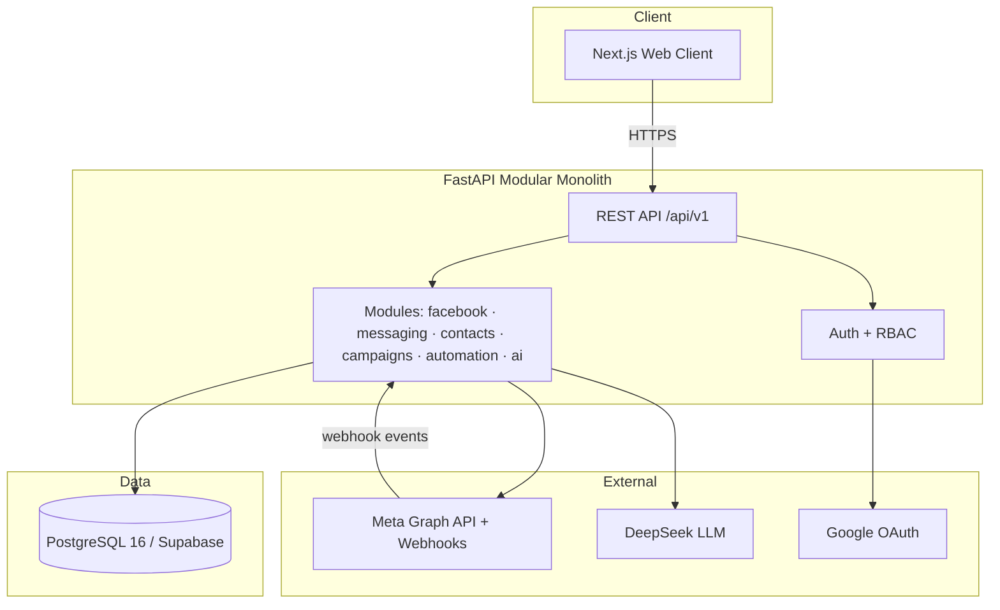

<p align="center">
  
</p>

<p align="center">
  <a href="#-features"></a>
  <a href="#-tech-stack"></a>
  <a href="#-tech-stack"></a>
  <a href="#-tech-stack"></a>
  <a href="#-tech-stack"></a>
  <a href="#-tech-stack"></a>
  <a href="LICENSE"></a>
</p>

<p align="center">
  <em><b>Connect. Engage. Grow.</b><br/>One workspace for every Facebook conversation, lead, and campaign — powered by AI.</em>
</p>

---

## 🌟 What is PagePilot?

**PagePilot** is a multi-tenant SaaS platform that lets businesses connect multiple **Facebook Pages** and manage every Messenger conversation, lead, and campaign from a single unified dashboard — eliminating manual, repetitive messaging entirely.

It transforms a raw Facebook inbox into a **growth engine**: capture leads automatically, reply instantly with AI and automations, and run compliant broadcast campaigns — all inside one premium, real-time workspace.

| | Manual Facebook DM chaos | PagePilot |
|---|---|---|
| 💬 | Tab-switching across Pages | A **single unified inbox** for every Page |
| ⏱️ | Missed & slow replies | Real-time updates + AI drafting + automation |
| 🔁 | Repeating the same answers | Templates, automations & AI replies |
| 🎯 | Leads lost in chat scrollback | A structured CRM with scoring & tags |
| 📣 | Sending offers one-by-one | Compliant broadcast campaigns with scheduling |
| 🤖 | No smart assistance | A built-in **AI business assistant** |

---

## ✨ Features

- 🔐 **Google Sign-In** — real account login, secured by JWT with refresh rotation and RBAC
- 🌐 **Facebook Page Connection** — secure Meta OAuth, encrypted page tokens, multi-Page support
- 💬 **Unified Inbox** — every conversation across all Pages in one place, with real-time polling, unread badges, and instant reply
- 👥 **Contacts & Leads** — auto-captured leads with profiles, names, avatars, status, and segmentation
- ⚡ **Automation Engine** — `Trigger → Condition → Action` workflows (e.g., keyword → auto-reply)
- 📣 **Broadcast Campaigns** — send a template to your chosen audience with configurable recipient limits, send gaps, scheduling, and stop control
- 🤖 **AI Assistant** — a natural-language business assistant powered by **DeepSeek**
- 📊 **Analytics** — real dashboard metrics computed from live data

---

## 🏗️ System Architecture



---

## 💡 Core Value Proposition

Three things no single competing tool combines today:

1. **True multi-Page, multi-tenant workspace** with a real CRM — not just a chat viewer.
2. **Policy-aware automation & campaigns** that are *useful* but *non-banning* — they respect Meta's 24-hour messaging window and never bypass Meta policies.
3. **A safe AI assistant** that does real business work behind an explicit permission model — never an unrestricted agent.

---

## 🛠️ Tech Stack

| Layer | Technology |
|---|---|
| **Frontend** | Next.js 15 · React 19 · TypeScript · Tailwind CSS |
| **Backend** | Python 3.12 · FastAPI · SQLAlchemy 2.0 (async) · Pydantic v2 |
| **Database** | PostgreSQL 16 (Supabase) |
| **Auth** | Google OAuth + JWT (access/refresh) |
| **AI** | DeepSeek (OpenAI-compatible) |
| **Messaging** | Meta Graph API + Webhooks (signature-verified) |

---

## 📦 Project Structure

```
Page-pilot-AI-/
├── docs/                       # Complete product & system architecture
├── backend/                    # FastAPI modular monolith (Python 3.12)
│   ├── alembic/                # Database migrations
│   ├── tests/                  # Pytest suite (17 tests)
│   └── src/app/
│       ├── core/               # config, security, db, errors, scripts
│       ├── models/             # SQLAlchemy ORM
│       ├── schemas/            # Pydantic schemas
│       ├── modules/            # auth, facebook, messaging, contacts, campaigns, automations, ai
│       ├── services/           # Meta client, message processor
│       └── workers/            # background tasks
├── frontend/                   # Next.js 15 + React 19 + TypeScript + Tailwind
└── README.md
```

---

## 🚀 Getting Started

### Prerequisites
- Python 3.12+
- Node.js 20+
- PostgreSQL (Supabase) — or SQLite for quick local testing
- Meta Developer App (for Facebook integration)
- Google OAuth credentials

### 1. Backend

```powershell
cd "FB Automate project"
.venv\Scripts\python.exe -m venv .venv            # first time only
.venv\Scripts\pip install -e "backend[dev]"
copy backend\.env.example backend\.env            # fill in real values
$env:PYTHONPATH = "backend/src"
.venv\Scripts\python.exe -m uvicorn app.main:app --host 127.0.0.1 --port 8000 --reload
```

Open **http://127.0.0.1:8000/docs** for the interactive API.

### 2. Frontend

```powershell
cd "FB Automate project/frontend"
npm install
npm run dev
```

Open **http://localhost:3000**.

### 3. Facebook Webhooks (for live messaging)

Expose your local backend with a tunnel and point Meta's webhook at it:

```powershell
cd "FB Automate project"
.\ngrok.exe http 8000
```

Then configure the **Callback URL** and **Verify Token** in your Meta App.

---

## ⚙️ Configuration

Copy `backend/.env.example` → `backend/.env` and set:

| Variable | Purpose |
|---|---|
| `DATABASE_URL` | Postgres/Supabase URL (or `sqlite+aiosqlite:///./pagepilot.db`) |
| `META_APP_ID` / `META_APP_SECRET` | Facebook Developer App credentials |
| `META_GRAPH_VERSION` | Graph API version (default `v26.0`) |
| `META_WEBHOOK_VERIFY_TOKEN` | Webhook verification secret |
| `GOOGLE_CLIENT_ID` / `GOOGLE_CLIENT_SECRET` | Google OAuth credentials |
| `LLM_PROVIDER` / `LLM_API_KEY` / `LLM_MODEL` | AI provider (e.g., `deepseek`, `deepseek-chat`) |
| `SECRET_KEY` | JWT signing secret |
| `ENCRYPTION_KEY` | Envelope encryption key for Meta tokens |

> 🔒 **Never commit `.env` or any secrets.** The `.env` file is gitignored.

---

## 🧪 Testing

```powershell
$env:PYTHONPATH = "backend/src"
.venv\Scripts\python.exe -m pytest backend/tests -q
```

> 17 tests passing · covers auth, Google OAuth, Meta page connect, webhooks, and the message pipeline.

---

## 🗺️ Development Status

| Area | Status |
|---|---|
| Authentication (Google + RBAC) | ✅ Done |
| Facebook Page connection | ✅ Done |
| Webhook message ingestion | ✅ Done |
| Unified inbox (real-time) | ✅ Done |
| Reply / send via Meta | ✅ Done |
| Contacts & leads | ✅ Done |
| Broadcast campaigns | ✅ Done |
| Automation engine | ✅ Done |
| AI assistant (DeepSeek) | ✅ Done |
| Analytics (real data) | ✅ Done |
| Production deployment | 🚧 In progress |

---

## 📚 Documentation

Full product specification and system architecture live in [`/docs`](./docs). Start with [`docs/00-overview.md`](./docs/00-overview.md).

## 🤝 Contributing

This is a proprietary project. Contact the repository owner for collaboration.

## 📄 License

Proprietary. All rights reserved.
