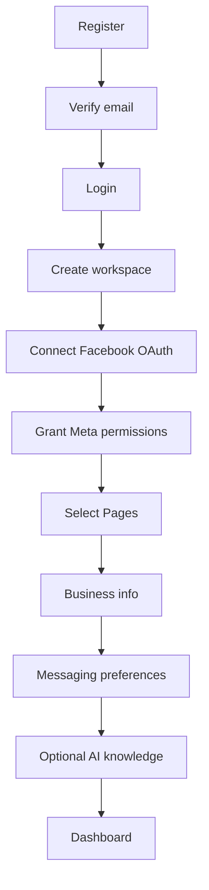
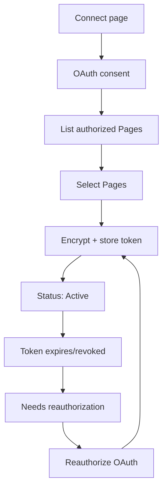
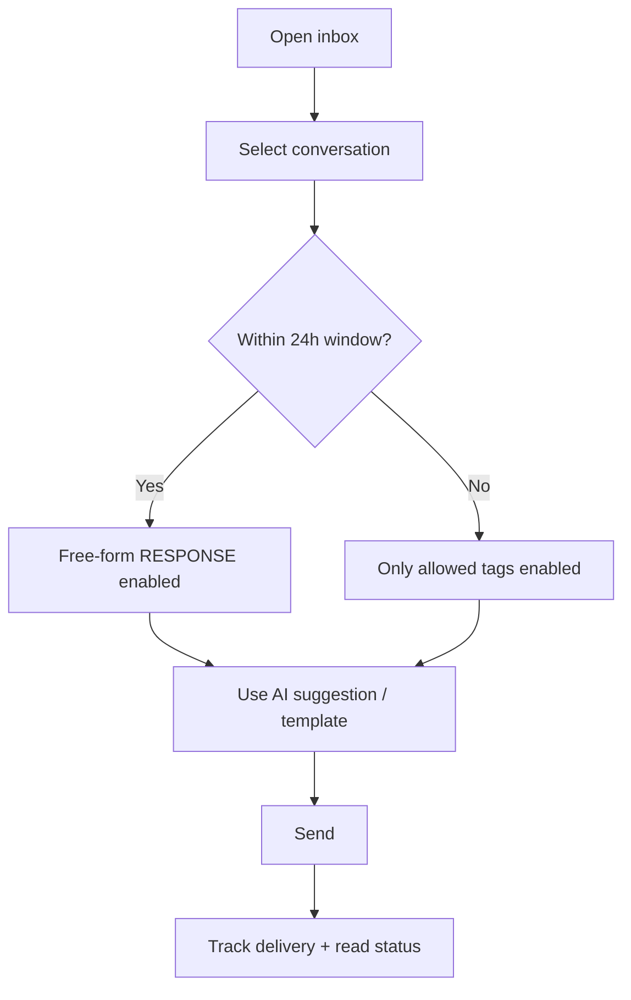
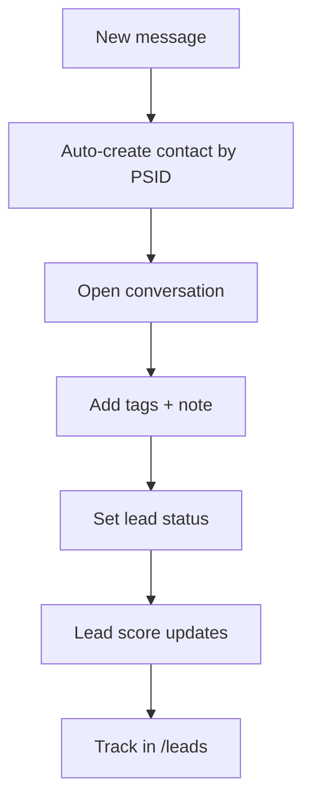
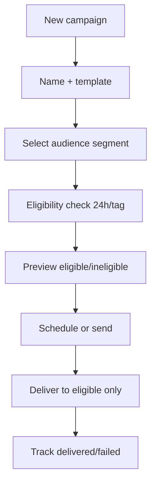
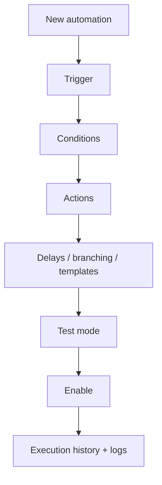
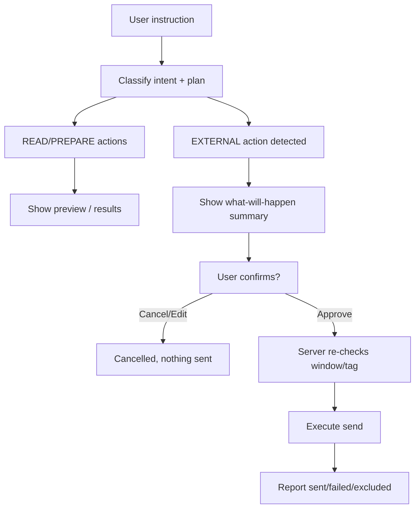

# 05 — User Flows

Reference: personas in `03-personas-use-cases.md`, UI in `06-ui-ux-specification.md`, Meta constraints in `13-meta-integration.md`, AI model in `19-ai-assistant.md`.

---

## 0. Meta Messaging Constraints (referenced throughout)

These rules govern every message PagePilot sends on behalf of a Page.

- **Standard messaging window:** 24 hours from the contact's last message. Within this window only, you may send free-form messages using `messaging_type=RESPONSE`.
- **`messaging_type` values:** `RESPONSE` (reply inside the 24-hour window), `UPDATE` (only for the update message tag), `TAGGED` (only for the `HUMAN_AGENT` tag).
- **Message tags:** `HUMAN_AGENT` allows a human-initiated conversation after the window closes. `UPDATE` allows a single follow-up after the window.
- **Outside the 24-hour window** you cannot send free-form promotional content; only allowed tags apply.
- **Hard rule:** PagePilot never sends an unrestricted message to a contact outside their window without a valid tag. Ineligible recipients are flagged or excluded, never silently sent.

MVP Meta permissions: `pages_show_list`, `pages_messaging`, `pages_manage_metadata`, `pages_read_engagement`.

---

## Flow 1 — Onboarding

**Goal:** a first-time user goes from registration to a working dashboard with a connected Page.

1. `register` → enter name, email, password; submit.
2. Email verification (click link) → account active.
3. `login` → land on `/onboarding` (first-time only).
4. Create **Workspace** (name, e.g., "Rania's Bakery").
5. Connect Facebook → OAuth ("Login with Facebook / Facebook Login for Business").
6. Grant Meta permissions (`pages_show_list`, `pages_messaging`, `pages_manage_metadata`, `pages_read_engagement`).
7. Select Pages from the authorized list (`/me/accounts`) to connect.
8. Configure business info (business name, timezone, default reply tone).
9. Set messaging preferences (default `messaging_type` behavior, off-hours handling, auto-reply on/off).
10. (Optional) Add AI knowledge (business hours, FAQ, product/pricing notes).
11. Land on `/dashboard` with the Page connected and inbox ready.

---

## Flow 2 — Connecting a Page (and Reauthorization)

**Initial connect**
1. From `/pages` or onboarding, click **Connect page**.
2. OAuth consent screen → user grants Meta permissions.
3. PagePilot reads `/me/accounts` to list authorized Pages.
4. User selects which Pages to connect to the workspace.
5. Page tokens stored server-side, encrypted (never exposed to client).
6. Connection status shows **Active** with token validity.

**Reauthorization (token expired / revoked)**
1. PagePilot detects expired/invalid token (Meta `expires_in`, or an API error on send/webhook).
2. `/pages` shows the Page as **Needs reauthorization**.
3. User clicks **Reauthorize** → same OAuth flow re-issued for that Page/user.
4. Fresh token saved; status returns to **Active**.
5. Any queued messages resume only after a valid token is present (no blind retries).

---

## Flow 3 — Answering a Message in the Inbox

1. User opens `/inbox`, sees conversations (sorted by recency, unread first).
2. User selects a conversation → `/inbox/[conversation]`.
3. Compose box shows current eligibility:
   - **Within 24-hour window** → "Reply" enabled, `messaging_type=RESPONSE`.
   - **Outside window** → reply restricted to allowed tags (`HUMAN_AGENT` via `TAGGED`, or `UPDATE`), otherwise send is disabled with an explanation.
4. User types, optionally applies an **AI-suggested reply** or saved template.
5. User clicks **Send**.
6. Delivery + read receipts tracked (`message_deliveries`, `message_reads`); failures surfaced with retry.

---

## Flow 4 — Converting a Conversation into a Lead

1. A contact messages a Page → contact auto-created per PSID (see `02-product-requirements.md` FR-E1).
2. User opens the conversation; the customer profile sidebar shows the contact.
3. User adds **tags** (e.g., product interest) and optional **note**.
4. User sets/advances **lead status**: New → Qualified → Contacted → Won / Lost.
5. (Optional) Rule-based **lead score** updates from tags/status/engagement.
6. Contact and conversation history remain linked for future reference on `/leads/[id]`.

---

## Flow 5 — Creating and Launching a Compliant Campaign

1. From `/campaigns` → **New campaign** (`/campaigns/new`).
2. Name the campaign; choose a **message template**.
3. Select **audience** via segmentation (tags, lead status, score, Page).
4. **Eligibility check** runs: which contacts are inside the 24-hour window (or tag-eligible).
5. Preview shows eligible vs. ineligible counts; ineligible are flagged/excluded.
6. Schedule delivery (or send now).
7. Campaign queued → messages delivered only to eligible recipients with correct `messaging_type`.
8. Delivery/failed tracked; retry for transient failures; campaign can be canceled.

---

## Flow 6 — Building a Simple Automation

1. From `/automation` → **New automation** (`/automation/new`).
2. Choose **Trigger** (e.g., new conversation, or intent detected).
3. Add **Condition(s)** (e.g., intent = "order status", label, score, keyword).
4. Add **Action(s)** (e.g., assign conversation, apply label, send permitted reply, set status, follow-up delay).
5. Configure delays/branching and variables/templates where applicable.
6. **Test mode** validates the logic against sample inputs.
7. **Enable** the automation; execution history and logs record each run and any error.

---

## Flow 7 — Using the AI Assistant to Run a Workflow (with Confirmation)

The assistant classifies each action as **READ / PREPARE / WRITE / EXTERNAL**. **EXTERNAL always requires explicit confirmation.**

1. User opens `/ai-assistant` and types an instruction, e.g., "Send the new collection message to everyone who asked about the spring line and is still within their window."
2. Assistant classifies intent and builds a plan (see `19-ai-assistant.md`).
3. Actions split by class:
   - **READ/PREPARE** (search eligible contacts, draft message, preview audience) run immediately or show a preview.
   - **EXTERNAL** (start send/campaign) halts for confirmation.
4. Assistant shows a **"what will happen" summary**: recipient count, target Page(s), message preview, eligibility/window status.
5. User reviews; ineligible recipients are flagged or excluded.
6. User confirms **Approve** (or **Cancel / Edit**).
7. On approve, the send executes through the send service, which **re-checks window/tag eligibility server-side** before any message leaves.
8. Assistant reports results (sent/failed/excluded) and any failure reason.

