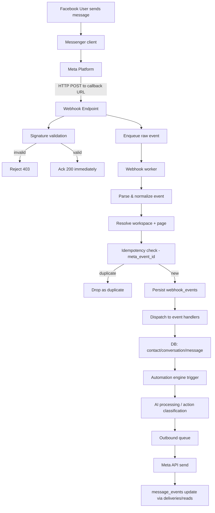

# 14 — Webhook Architecture (Meta Event Ingestion)

> **Scope.** How PagePilot receives, validates, de-duplicates, and routes Meta Messenger webhook events into durable, idempotent internal state. This is the inbound half of the system; the outbound half is `15-messaging-engine.md`. Authoritative Meta facts for permissions, endpoints, and window rules live in `13-meta-integration.md`.

---

## 1. Purpose & Design Goals

The webhook pipeline is the **critical, single ingress point** for all Messenger activity. It must be:

1. **Fast to acknowledge** — Meta retires deliveries quickly if we do not return HTTP 200 promptly.
2. **Idempotent** — the same event may be delivered more than once; we must never double-process it.
3. **Durable** — an event that arrives must survive worker restarts until it is fully processed.
4. **Isolated per tenant** — every parsed event is scoped to a `workspace_id` (via the source Page).
5. **Observable** — every event is logged with its validation outcome, processing state, and any error.

---

## 2. Full Event Flow

The complete path of a Messenger event through the system:



Key principle: **the HTTP endpoint acknowledges the moment the payload is validated and enqueued**, never after full business processing. Everything after the ack happens asynchronously in workers.

---

## 3. Webhook Verification (`GET` Challenge)

When you configure a webhook, Meta sends a `GET` request to confirm you own the callback URL. You must respond with the `hub.challenge` value if `hub.verify_token` matches.

Query parameters received:

| Param | Description |
| --- | --- |
| `hub.mode` | `subscribe` (or `unsubscribe`) |
| `hub.verify_token` | A secret chosen by us and stored in the Meta App's webhook config |
| `hub.challenge` | A random string to echo back |

Verification logic:

1. Read `hub.mode`, `hub.verify_token`, `hub.challenge`.
2. Require `hub.mode == "subscribe"`.
3. Constant-time compare `hub.verify_token` with our configured `VERIFY_TOKEN` secret.
4. On match, respond `200` with the raw `hub.challenge` value as the body.
5. On any mismatch, respond `403` and log (do not echo the challenge).

The `verify_token` is a **distinct secret from the app secret** (section 4). It is stored in config/env and never logged.

---

## 4. Signature Validation (`POST` Payloads)

Every `POST` webhook includes the header `X-Hub-Signature-256`, which authenticates that the payload came from Meta and was not tampered with.

```
X-Hub-Signature-256: sha256=<hex-encoded HMAC>
```

Validation:

1. Read the raw request body **as received** (do not re-serialize — whitespace/ordering changes the digest).
2. Compute `HMAC_SHA256(app_secret, raw_body)`.
3. Compare with the hex value in the header using a **constant-time compare**.
4. If missing or mismatched → reject with `403`, record a `signature_valid=false` event/log, and do **not** process.

> The HMAC key here is the **App Secret** (from the Meta App dashboard), not the `verify_token` used in section 3.

Timing note: signature validation is cheap and is done **synchronously on the endpoint** before we ack, so we only ever enqueue authenticated payloads.

---

## 5. Event Shape & Identifiers

A typical `object: "page"` delivery:

```json
{
  "object": "page",
  "entry": [
    {
      "id": "<PAGE_ID>",
      "time": 1730000000000,
      "messaging": [
        { "sender": { "id": "<PSID>" },
          "recipient": { "id": "<PAGE_ID>" },
          "timestamp": 1730000000000,
          "message": { "mid": "m_aBcD...", "text": "..." } }
      ]
    }
  ]
}
```

Identifiers we capture:

| Identifier | Field | Purpose |
| --- | --- | --- |
| **Page ID** | `entry[].id` | Resolve `facebook_pages` → `workspace_id` |
| **PSID** | `entry[].messaging[].sender.id` | Recipient identity (page-scoped) |
| **Message ID (`mid`)** | `message.mid` (or `postback.mid`) | Idempotency for message-level dedup |
| **Event ID** | Derived (see below) | Idempotency for the whole webhook delivery |

### Event ID derivation

Meta does not always provide a single stable event ID per subscription delivery. We derive a deterministic idempotency key:

- Prefer an explicit `meta_event_id` when present.
- Else, if the entry has a single `messaging` object with a `message.mid`, use `pageId:mid`.
- Else, hash `pageId + eventType + sender + recipient + timestamp` (SHA-256) as a stable surrogate.

This key populates `webhook_events.meta_event_id` (unique), which is the backbone of idempotency (section 7).

---

## 6. Subscribed Event Types

We subscribe to (and handle):

| Messaging event | Purpose in PagePilot |
| --- | --- |
| `messages` | Inbound text/attachment; PSID → contact; trigger automation + AI |
| `message_deliveries` | Outbound delivery confirmed; update `message_events` (delivered) |
| `message_reads` | Recipient read receipts; update `message_events` (read); conversation "read" signal |
| `message_echoes` | Echo of messages we sent (dedup guard against double-ingest) |
| `messaging_postbacks` | Button/menu taps; automation + AI trigger |

Additional subscriptions we accept/handle gracefully (not required for MVP): `messaging_seen` (typing indicator), `message_reactions` (optional engagement signal), `messaging_referrals` (`ref` attribution for lead scoring).

> Per `13-meta-integration.md` we subscribe via `pages_manage_metadata`. Every subscribed event type is normalized into a common internal form before dispatch.

---

## 7. Idempotency & Duplicate Handling

Meta **may deliver the same event more than once** (network retries, message re-delivery, or because we timed out before the ack). Duplicate handling is mandatory and layered:

1. **`meta_event_id` unique constraint** on `webhook_events` — the primary dedup. On conflict, the event is already processed; we drop it (idempotently) and increment a `duplicates` counter for observability.
2. **`messages.meta_message_id` unique** — if two deliveries arrive with different event keys but the same `mid`, the message is not inserted twice.
3. **`message_events` unique `(message_id, event_type, meta_event_id)`** — a delivery/read that re-arrives does not create duplicate lifecycle rows.
4. **`message_echoes` filtering** — echoes of our own outbound messages are recognized by direction/mid and are not re-stored as inbound.

Dedup rule of thumb: **treat each event as at-least-once, and make every write idempotent on a unique key.**

---

## 8. Retries & Ack Semantics

### Meta's retry behavior

- Meta waits for a `200` response within a short window (on the order of seconds) and **retries** undelivered events with backoff over a limited retry window.
- If we do not ack in time, Meta may re-send the same payload — this is exactly why idempotency (section 7) is essential.

### Our contract

- **Ack (`200`) only after** signature validation **and** successful enqueue to a durable queue (Redis stream / broker). This guarantees "we received and will process it."
- **Do not** ack after full business processing — that pushes processing into the request path and risks Meta retry storms.
- Invalid signature or unverifiable page → `403` (never ack). Meta will retry a few times, then stop; we log each rejection.

The result is a clean **at-least-once + idempotent** pipeline: fast acks, guaranteed delivery, no duplicates.

---

## 9. Numbered Processing Sequence

After the endpoint acks, a worker processes each raw event in this order:

1. **Receive & validate signature** (endpoint, synchronous).
2. **Enqueue raw payload** with minimal metadata (received_at, signature_valid).
3. **Parse payload** — extract `object`, `entry[]`, `messaging[]`, Page ID, PSID, and event/message IDs.
4. **Resolve tenant** — map Page ID → `facebook_pages` → `workspace_id`. If unknown Page → quarantine + log (do not silently drop-only; investigate).
5. **Compute idempotency key** and **attempt insert** into `webhook_events`. Conflict → mark duplicate, stop.
6. **Normalize** to an internal typed event (inbound-message, delivery, read, echo, postback).
7. **Persist core entities**:
   - Upsert `contacts` (auto-create on first PSID message; see `16-lead-crm.md`).
   - Resolve/create `conversations`.
   - Insert `messages` (idempotent on `meta_message_id`).
   - Insert `message_events` for delivery/read (idempotent).
8. **Trigger automation engine** with the normalized event (`18-automation-engine.md`).
9. **Enqueue AI processing** when applicable (intent detection, draft, classification; `19-ai-assistant.md`).
10. **Emit outbound** via `outbound_jobs` only through the messaging engine eligibility checks (`15-messaging-engine.md`).
11. **Mark `processed_at`** and clear the event from the queue on success.

---

## 10. Failure Handling & Dead-Letter Queue (DLQ)

Failures are separated into **retryable** and **permanent**:

| Failure class | Examples | Handling |
| --- | --- | --- |
| **Transient** | Broker/DB timeout, worker restart, downstream 5xx | Re-queue with exponential backoff (bounded retries, e.g. 8) |
| **Malformed payload** | Unexpected shape, missing `id`, unparseable | Log + `signature_valid=true` but `error` recorded; route to DLQ for inspection |
| **Unknown Page** | Page not connected / disconnected | Quarantine; surface "Page disconnected" (not dropped silently) |
| **Persistent write conflict** | Repeated idempotency/constraint failure | Treated as duplicate if conflict key matches; else DLQ |

**Dead-letter handling:**

- After retries are exhausted, the event is moved to a **dead-letter store** (a table/queue keyed by raw event) with `error`, `attempts`, and `last_failure_at`.
- DLQ events are **surfaced in the ops surface** (observability; `27-observability.md`) and are **replayable** from the UI/ops tooling once the root cause is fixed.
- A DLQ entry never blocks the pipeline; it is side-tracked and reported, keeping the main queue flowing.

---

## 11. Logging & Observability

For every event, log (structured, without secrets or full personal content — truncate message bodies):

- Page ID, workspace ID, event type, `meta_event_id`, `signature_valid`, `processing latency`, `status` (processed / duplicate / dlq), and error (if any).
- Counters: received, acked, duplicate, normalized, processed, quarantined, dead-lettered.
- Alerts: DLQ growth, ack latency rising above threshold, high duplicate rate (may indicate a stalled consumer), or a sustained `403` rate (misconfigured secret).

See `27-observability.md` for the tracing/metric conventions used across the platform.

---

## 12. Summary of Guarantees

| Guarantee | Mechanism |
| --- | --- |
| Authenticity | `X-Hub-Signature-256` HMAC with app secret (constant-time) |
| Verification | `hub.challenge` echo on matching `verify_token` |
| Fast ack | Ack after validate + enqueue, before business processing |
| No lost events | Durable queue + acknowledged-after-enqueue |
| No duplicate side-effects | `meta_event_id` unique + per-row idempotent writes |
| Tenant isolation | Every event resolved to `workspace_id` via source Page |
| Recoverability | Bounded retries + replayable dead-letter store |
