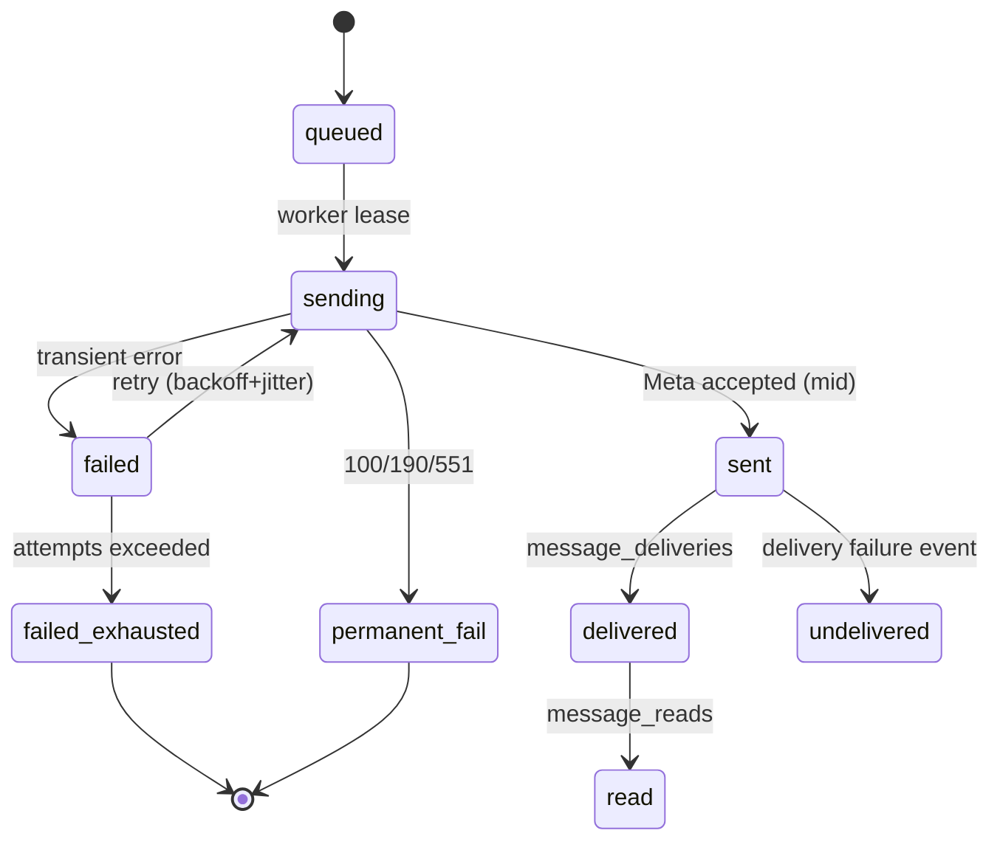

# 15 — Messaging Engine (Processing & Send)

> **Scope.** The engine that turns raw Meta events (from `14-webhook-architecture.md`) into normalized internal conversations, runs automation + AI to decide what to do, and reliably sends outbound messages within Meta policy. Authoritative Meta constraints (messaging types, 24h window, tags, rate limits, error codes) live in `13-meta-integration.md`.

---

## 1. Two Halves

The messaging engine has two distinct halves that meet at the `outbound_jobs` queue:

1. **Inbound processing** — normalize → resolve → store → automate → decide an action.
2. **Outbound send engine** — eligibility checks → queue → execute → track → retry/fail.

They are decoupled so a slow AI step never blocks a send, and a Meta rate limit never blocks ingestion.

---

## 2. Inbound Processing Pipeline

For each normalized event (already validated and de-duplicated by the webhook layer):

1. **Normalize** into a typed internal event (`inbound_message`, `delivery`, `read`, `echo`, `postback`).
2. **Validate** the shape and minimum fields (PSID, Page ID, event/message IDs).
3. **Resolve**:
   - **Page** → `facebook_pages` → `workspace_id`.
   - **Contact** → upsert `contacts` by `(workspace_id, psid)`; auto-create on first message.
   - **Conversation** → find open conversation for `(page, contact)` or create one; update `last_message_at`, `unread_count`, `status`.
4. **Store message** idempotently (unique `meta_message_id`); store `message_events` for delivery/read.
5. **Trigger automation** (event matched against enabled `automations`; `18-automation-engine.md`).
6. **AI processing** when required — intent detection, lead classification, response drafting/action classification (`19-ai-assistant.md`, `20-ai-tools.md`).
7. **Action determination** — a concrete outcome: send a reply, assign a label, set lead status, notify an agent, or no-op.
8. **Queue** — any send intent becomes an `outbound_jobs` row (not a direct synchronous HTTP call).
9. **Execute** — a worker picks up `outbound_jobs` and calls the Meta API (subject to section 4 eligibility).
10. **Store result** — `messages` (outbound) + `message_events` (sent/failed).
11. **Update UI** — conversation/message state is written through so the inbox reflects reality (via websocket/polling; see `07-system-architecture.md`).

---

## 3. Outbound Send Engine

### 3.1 Messaging types

| `messaging_type` | Meaning | When we use it |
| --- | --- | --- |
| `RESPONSE` | Reply to a received message | Human/AI reply within the 24h window (promotional allowed) |
| `UPDATE` | Proactive update | Proactive-but-permitted update within the 24h window |
| `TAGGED` | Outside-window, valid Message Tag, non-promotional | Post-window follow-ups that match an approved tag |

### 3.2 The 24-hour standard messaging window

- A person's inbound message (or other listed window-opening action) opens a **24-hour window** during which the business may send messages, including promotional.
- After the window closes, sending is only allowed with a **valid Message Tag** (`TAGGED`, non-promotional) — otherwise the send fails.
- We track `last_inbound_at` effectively via `conversations.last_message_at` + `contact_events`/`message_events` and compute window eligibility **at send time** (never trust a stale flag).

### 3.3 Message tag validation

- A `TAGGED` send must carry a currently-supported tag that matches its non-promotional use case (e.g., `HUMAN_AGENT` within its allowed window).
- Tag list **changes frequently** — we store the supported tag list in config and **re-check it at send time**, failing closed (reject) if a tag is no longer valid.
- Promotional content is **never** sent as `TAGGED`.

### 3.4 Eligibility check (enforced before every send)

Every `outbound_jobs` execution runs a **send-time eligibility gate**:

1. Inside 24h window → `RESPONSE`/`UPDATE` allowed (promotional OK).
2. Outside window + valid non-promotional tag → `TAGGED` allowed.
3. Outside window + no eligible tag → **skip/ineligible**, mark recipient `skipped`, surface honestly ("outside messaging window").
4. Unreachable/blocked PSID → `permanent_fail` (see error table) — no retry.

This gate is re-run at **actual execution time**, not just at queue time, because window state can change between queue and send.

---

## 4. Error Handling & Retry Strategy

Common Meta error codes and our handling (source: `13-meta-integration.md`):

| Code | Meaning | Retry? | Behavior |
| --- | --- | --- | --- |
| `613` | Rate limit exceeded | Yes | Exponential backoff + **jitter**; respect `X-App-Usage` headers |
| `10` | Permissions error | Yes (bounded) | Validate `pages_messaging` + token; surface "Page reconnect" |
| `100` | Invalid parameter | No (permanent) | Fix payload/bug; log; mark `permanent_fail` |
| `190` | Access token expired | No (permanent) | Mark token invalid; request re-auth |
| `551` / `1545041` | Person unavailable (blocked/deactivated) | **No** | Mark recipient unavailable; `permanent_fail`; **no retry** |

### Retry policy (exponential backoff + jitter)

- Transient failures (`613`, transient `10`, network/5xx) retry with **exponential backoff** (base e.g. 1s, doubling) plus **random jitter** to avoid thundering-herd on rate-limit recovery.
- Bounded attempts (e.g., 8), then `failed` → optionally DLQ/inspection.
- **No-retry** for `551`/`1545041` (person unavailable) — retrying wastes calls and risks policy issues.
- `190`/`100` are permanent: mark and surface; no blind retry.

---

## 5. Rate Limiting (300 sends/sec per Page)

Messenger Send API allows **300 calls/sec per Page** (text/links/reactions/stickers; lower for audio/video). Our design:

- A **per-Page token bucket / limiter** in the send worker caps throughput at a safe ceiling **well below 300/s** (configured, e.g. 200/s) to leave headroom.
- Sends for the same Page are serialized through the limiter; `outbound_jobs` for a Page are drained in order.
- We honor `X-App-Usage` / `X-Business-Use-Case-Usage` response headers to adaptively slow down before hitting hard limits.
- On `613`, the limiter enters a cooldown and the retry/backoff handling (section 4) takes over.

---

## 6. Queue Model (`outbound_jobs`)

`outbound_jobs` is the single queue of send intent (see `11-database-architecture.md`). Key fields:

| Field | Purpose |
| --- | --- |
| `job_type` | `direct_send` (conversation reply) or `campaign_item` |
| `recipient_psid` | Target PSID |
| `messaging_type` | `RESPONSE` / `UPDATE` / `TAGGED` |
| `tag` | Message tag (nullable) |
| `payload` | JSONB message content (text/attachments) |
| `status` | `queued` → `sending` → `sent` / `failed` / `permanent_fail` |
| `scheduled_for` | Delayed/planned send time (automation delays, campaign schedule) |
| `attempts`, `locked_at` | Lease + retry bookkeeping |
| `error` | Last error code/message |

Worker lease semantics: a worker claims `queued` jobs with `locked_at` + `attempts` increment; jobs whose lock expires (worker crash) are re-claimed. This gives exactly-once **execution** semantics guarded by idempotent result writes.

---

## 7. Per-Message State Machine

State transitions for an outbound message (tracked across `outbound_jobs`, `messages`, and `message_events`):

- `sent` = Meta accepted and returned a `message_id` (`mid`).
- `delivered` / `read` are confirmed by inbound `message_deliveries` / `message_reads` events (round-trip through `14-webhook-architecture.md`).
- `undelivered` captures delivery failures Meta reports after a successful send accept.

---

## 8. UI Update & Delivery Tracking

- As the state machine progresses, the inbox conversation view updates message delivery badges (`sent`/`delivered`/`read`) via the persisted `message_events`.
- Delivery/read events are normalized inbound events (webhook layer) that update `message_events` idempotently; no separate polling of Meta is required for MVP.
- Failed/permanent-failed sends surface inline with the reason (e.g., "contact blocked", "outside window", "rate limited — will retry").

---

## 9. Summary of Policy Guarantees

1. Every outbound send records its `messaging_type` and `tag`, and passes the send-time eligibility gate.
2. `TAGGED` sends are validated against the current supported tag list and are non-promotional.
3. `551`/person-unavailable is **never retried**.
4. Per-Page throughput is capped well under 300/s with adaptive throttling.
5. Window/tag state is evaluated at **execution time**, not queue time.
